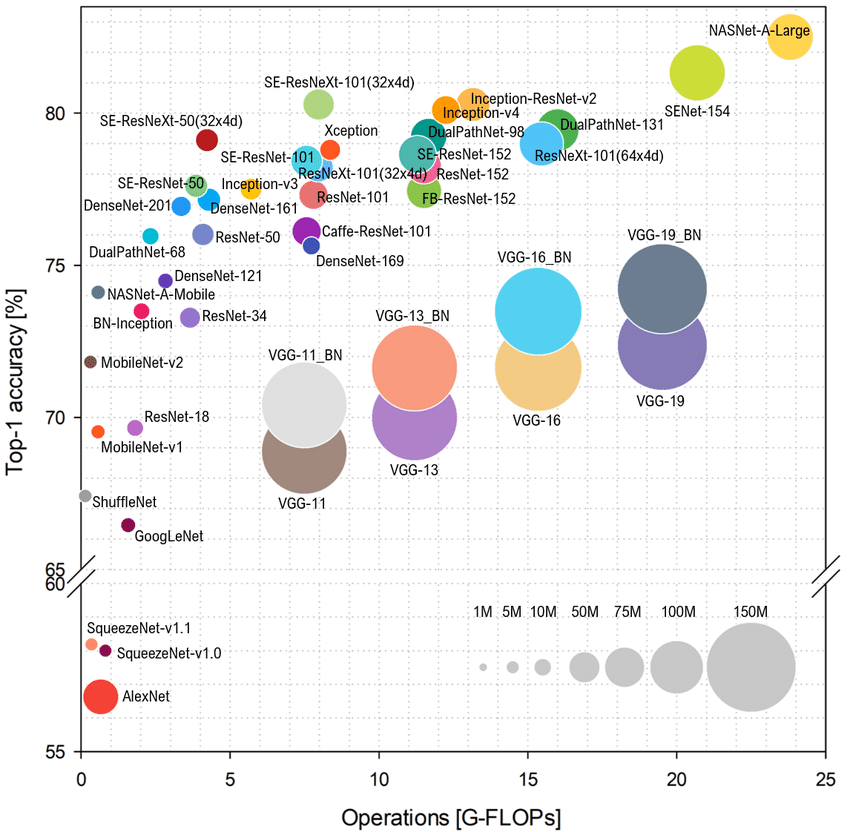
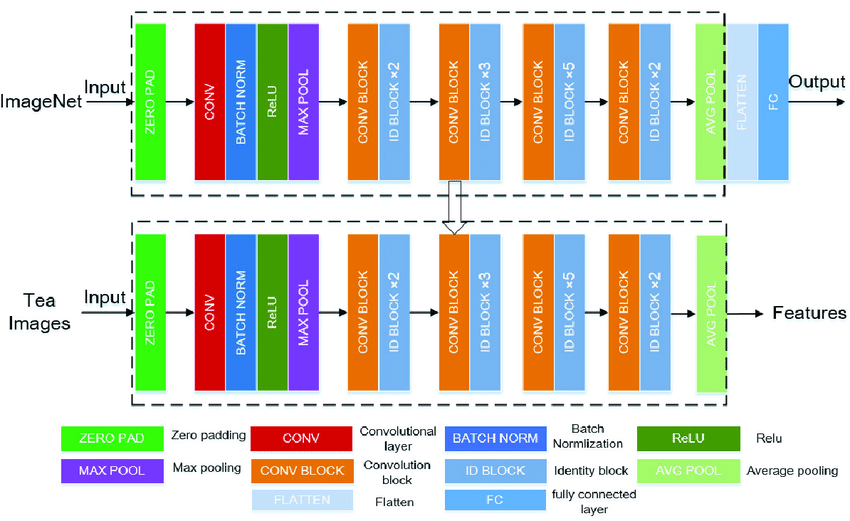
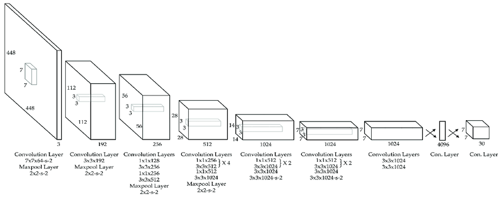
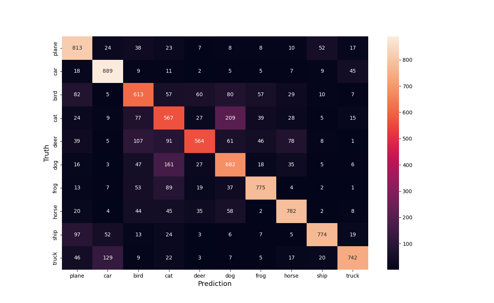
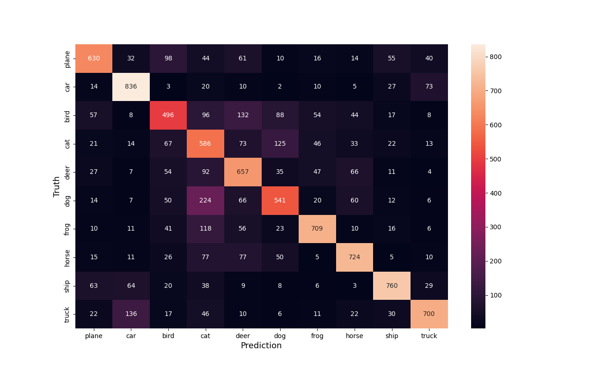

# About this Repository
This repository discusses a CNN model development that uses CIFAR-10 data as a starting point.

# How to Setup the Running Environment
## Pre-requisite/Development Environment
- Python3, version 3.10.6
- Pip3, version 22.0.2
- Other dependencies: see requirements.txt

# Set up the running environment
Run the following commands to complete the setup:
```
# verify local python3 version
python3 --version

# create the virtual environment
python3 -m venv venv_see
# activate the virtual environment
source venv_see/bin/activate
# install dependencies
pip3 install -r requirements.txt
```

# Available Modules to Run
## Model training and evaluation
```
source venv_see/bin/activate
# run the grayscale model
python3 main.py --n_channel 1

# run the RGB model
python3 main.py --n_channel 3
```
OR
```
# run the grayscale model
venv_see/bin/python3 main.py --n_channel 1
# run the RGB model
venv_see/bin/python3 main.py main.py --n_channel 3
```
### Module Outputs
- log files
	- log_compilation.log: generated from training and evaluating the chosen model
	- log_inference.log: generated from running the inference against the chosen model
- in outputs directory:
	- models_performances_tables.txt: this text file contains performance raw outputs, such as accuracy of each class, model architecture used at the time (given no other versioning tools are used in this project), configurations and hyperparameters used
	- a new directory named by the chosen model, which contains checkpoint files, saved model file, overall confusion matrix and confusion metrics by classes

## Inference
```
source venv_see/bin/activate
python3 inference.py
```
OR
```
venv_see/bin/python3 inference.py
```
### Inference Outputs
- log_inference.log: log file for the inference process

# Models Performances Report
## Dataset Details
- Dataset: CIFAR-10
- Number of Classes: 10
- Total Number of Images: 60,000
- Training Samples: 50,000
- Test Samples: 10,000

## Model Architecture Discussion
- Model: SimpleCNN & SimpleCNN_GrayScale 
- Architecture: A simple CNN model that is developed locally on a Dell Inspiron 15 (2015) with CPU, RGB and Grayscale versions are available.
  - Convolution Layer - ReLU - Max Pooling
  - Convolution Layer - ReLU - Max Pooling
  - Flatten
  - Fully Connected Layer - ReLU 
  - Fully Connected Layer 
- Number of Parameters:
  - SimpleCNN: 268,362
  - SimpleCNN_GrayScale: 545,098

This architecture is inspired by the following resources:

1. Models performances comparison fetch from https://www.researchgate.net/figure/Ball-chart-reporting-the-Top-1-and-Top-5-accuracy-vs-computational-complexity-Top-1-and_fig1_328509150


2. ResNet50 architecture, fetched from https://www.researchgate.net/figure/The-framework-of-the-Resnet50-The-Resnet50-model-trained-on-ImageNet-which-is_fig3_344190091  


3. YOLO architecture, fetch from https://www.researchgate.net/figure/YOLO-network-architecture-adapted-from-44_fig1_330484322


4. VGG16 architecture, fetch from https://neurohive.io/en/popular-networks/vgg16/


While researching these architects, I have noticed Max Pooling is used more often than Average Pooling, hence, I choose Max Pooling as well.

## Training Details
- Optimizer: SGD - for its computational efficiency
- Learning Rate: 0.001
- Batch Size: 8
- Epoch Size: 6
- Loss Function: CrossEntropyLoss

### SimpleCNN
- Training Duration: 2250.66 seconds/37.5 minutes (average on 8 runs) on Dell, 240.53 seconds/4 minutes (average on 3 runs) on a borrowed MacBook Pro with M1 chip
- Training Accuracy: %

### SimpleCNN_GrayScale
  - SimpleCNN_GrayScale: 545,098

## Performance Metrics
### SimpleCNN
#### Test Accuracy

| model name | num of images | class_name | accuracy |
| :---- | :---- | :---- | :---- |
|SimpleCNN|10,000|ALL|72%|
|SimpleCNN|1000|plane|81.30%|
|SimpleCNN|1000|car  |88.90%|
|SimpleCNN|1000|bird |61.30%|
|SimpleCNN|1000|cat  |56.70%|
|SimpleCNN|1000|deer |56.40%|
|SimpleCNN|1000|dog  |68.20%|
|SimpleCNN|1000|frog |77.50%|
|SimpleCNN|1000|horse|78.20%|
|SimpleCNN|1000|ship |77.40%|
|SimpleCNN|1000|truck|74.20%|

#### Confusion Matrix


Refer to confusion_metrics_by_classes/SimpleCNN directory for confusion metrics by classes.

### SimpleCNN_GrayScale
#### Test Accuracy
| model name | num of images | class_name | accuracy |
| :---- | :---- | :---- | :---- |
|SimpleCNN_GrayScale|10,000|ALL|66%|
|SimpleCNN_GrayScale|1000|plane|63.00%|
|SimpleCNN_GrayScale|1000|car  |83.60%|
|SimpleCNN_GrayScale|1000|bird |49.60%|
|SimpleCNN_GrayScale|1000|cat  |58.60%|
|SimpleCNN_GrayScale|1000|deer |65.70%|
|SimpleCNN_GrayScale|1000|dog  |54.10%|
|SimpleCNN_GrayScale|1000|frog |70.90%|
|SimpleCNN_GrayScale|1000|horse|72.40%|
|SimpleCNN_GrayScale|1000|ship |76.00%|
|SimpleCNN_GrayScale|1000|truck|70.00%|

#### Confusion Matrix


Refer to confusion_metrics_by_classes/SimpleCNN_GrayScale directory for confusion metrics by classes. 

## Inference Details

### SimpleCNN
- Average Inference Time per Image: 3.3872 ms
- Total Inference Time: 4.2340 seconds

### SimpleCNN_GrayScale
- Average Inference Time per Image: 2.2074 ms
- Total Inference Time: 2.7593 seconds

### Hardware Used
Dell Inspiron 15, 2015

# Future Planning
3 months time period is granted to develop this model, here are few things I would do:
- Dive in further into the CIFAR-10, even CIFAR-100 datasets, understand their characteristics.
- Small image research. Given images from CIFAR-10 are of 32 x 32 in size, therefore, the number of pixels are much less compared to usual images. 
1. Areas of future research
	
2. Techniques of future research
3. Potential Experiments
4. Potential model improvements
   - 
5. 
